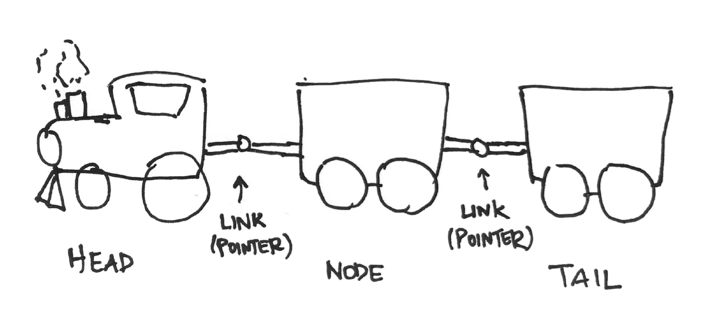
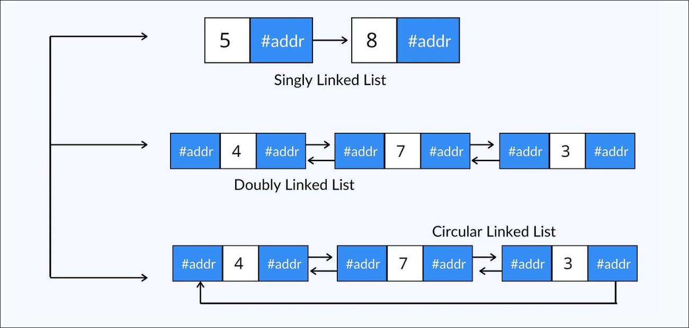
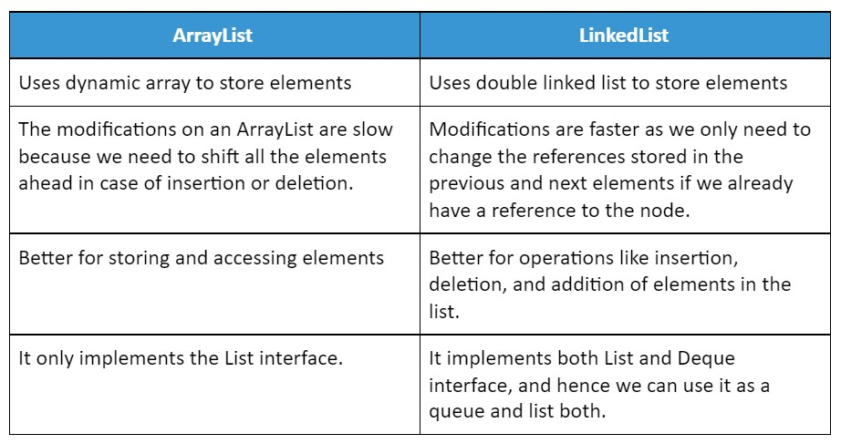
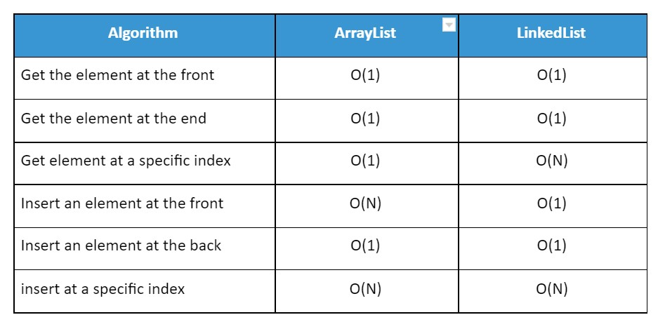

## Linked List?

A linked list is one of the data structures used in programming.

**_Data structures_** in programming are organized formats for _storing, managing, and accessing_ data efficiently. Linked List is like how train coach are connected to each other. Just like a below picture example

In techincal words, **_A linked list is a data structure that stores a sequence of elements, or nodes, in a linear order. It enabling efficient insertion and deletion of elements without needing to shift data._**



A LinkedList is made up of **nodes**, where each node contains:

- **Data:** A reference to the actual object stored in the list.
- **Pointer to the next node:** A reference to the next node in the list.
- **Pointer to the previous node (for doubly linked lists):** A reference to the previous node in the list.


## Types of Linked Lists



## Memory usage

Each node stores two additional references (or one for singly linked lists), which adds to the memory overhead compared to array or arraylist.

For large datasets, ArrayLists are usually more memory-efficient unless frequent insertions and deletions are required, in which case LinkedLists might be preferable despite the higher memory usage.

## Some Basic Operations

Implementing a Singly Linked List in Java using Class.

```java
public class SinglyLinkedList {
  class Node {
    int data;
    Node next;

    Node(int data) {
      this.data = data;
      this.next = null;
    }
  }

  public Node head = null;
  public Node tail = null;

  //*******Insertion Operation*******

  // add at tail
  public void addNode(int data) {
    Node newNode = new Node(data);

    if (head == null) {
      head = newNode;
      tail = newNode;
    } else {
      tail.next = newNode;
      tail = newNode;
    }
  }

  // add at head
  public void addAtHead(int data) {
    Node newNode = new Node(data);
    if (tail == null) {
      head = newNode;
      tail = newNode;
    } else {
      newNode.next = head;
      head = newNode;
    }
  }

  // add at nth

  public void addAtNth(int index, int data) {
    Node newNode = new Node(data);
    Node current = head;
    int i = 0;

    Node previos = current;
    Node forward = current;
    while (current != null) {
      if (i == index) {
        forward = current.next;
        previos.next = newNode;
        newNode.next = forward;
        break;
      }
      i++;
      previos = current;
      current = current.next;
    }

  }

  // *******Deletion Operation*******

  // Delete at head
  public void deleteNodeAtHead() {
    if (head != null) {
      head = head.next;
    }
  }

  // Delete Tail
  public void deleteNodeAtTail() {
    Node current = head;
    while (current != null) {
      if (current.next.next == null) {
        current.next = null;
        tail = current;
        break;
      }
      current = current.next;
    }
  }

  // Delete node from middle

  public void deleteNodeFromMiddle() {

    Node current = head;
    Node previous = null;
    int count = 0;

    while (current != null) {
      count++;
      current = current.next;
    }
    current = head;

    System.out.println(count);
    if (count == 1) {
      head = null;
      return;
    }

    int i = 0;
    while (current != null) {
      if (i == count / 2) {
        previous.next = current.next;
        break;
      }
      previous = current;
      current = current.next;
      i++;
    }
  }

  public void deletNodeAtNth(int index) {
    Node current = head;
    int i = 0;
    Node previous = null;

    if (index == 0) {
      this.deleteNodeAtTail();
      return;
    }

    while (current != null) {
      if (i == index) {
        previous.next = current.next;
        break;
      }
      previous = current;
      i++;
      current = current.next;
    }
    current = head;

  }

  // *******Reverse the linkedlist*******

  public void reverse() {
    Node current = head;
    Node next = null;
    Node previous = null;

    while (current != null) {
      next = current.next;
      current.next = previous;
      previous = current;

      current = next;
    }
    head = previous;
  }

  public void print() {
    Node current = head;
    if (head == null) {
      System.out.println("Empty List");
      return;
    }
    while (current != null) {
      System.out.print(current.data + " -> ");
      current = current.next;
    }
    System.out.println();
  }

  public static void main(String[] args) {
    SinglyLinkedList list = new SinglyLinkedList();
    list.addNode(1);
    list.addNode(2);
    list.addNode(3);
    list.addAtHead(3);
    list.addAtNth(2, 9);
    list.addAtHead(2);
    list.print();
    // list.deleteNodeAtHead();
    // list.print();
    // list.deleteNodeAtTail();
    // list.deleteNodeFromMiddle();
    // list.print();
    // list.deleteNodeFromMiddle();
    // list.print();
    // list.deleteNodeFromMiddle();
    // list.print();
    // list.deleteNodeFromMiddle();
    // list.deletNodeAtNth(3);
    // list.deletNodeAtNth(1);
    // list.deletNodeAtNth(0);
    list.print();
    list.reverse();
    list.print();
  }
}
```

**Remove Duplicates from Sorted List**

```java
public ListNode deleteDuplicates(ListNode head) {

    ListNode current = head;
    System.out.println(head);
    Set<Integer> set = new TreeSet<>();

    while (current != null) {
      set.add(current.val);
      current = current.next;
    }

    // Set for Removing Duplicates: I used a TreeSet to both remove duplicates and
    // automatically sort the values in ascending order.

    // Dummy Node: The dummy node simplifies handling the head of the new list. It
    // points to the first node of the new linked list.

    // Creating the New List: For each value in the set, I create a new node and
    // link it to the previous node.
    ListNode dummy = new ListNode(0);
    ListNode temp = dummy;

    for (Integer i : set) {
      temp.next = new ListNode(i);
      temp = temp.next;
    }

    return dummy.next;
  }
```

**Merge Two Sorted LinkedList**

```java
public ListNode mergeTwoLists(ListNode list1, ListNode list2) {
    List<Integer> l = new ArrayList<>();

    while (list1 != null) {
      l.add(list1.val);
      list1 = list1.next;
    }
    while (list2 != null) {
      l.add(list2.val);
      list2 = list2.next;
    }

    Collections.sort(l);

    ListNode dummy = new ListNode(0);
    ListNode temp = dummy;
    // while (l.size() > 0) {
    for (int i = 0; i < l.size(); i++) {
      temp.next = new ListNode(l.get(i));
      temp = temp.next;
    }

    return dummy.next;
  }

```

## ArrayList vs LinkedList



## Worst-case Complexities


