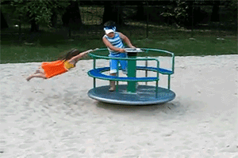
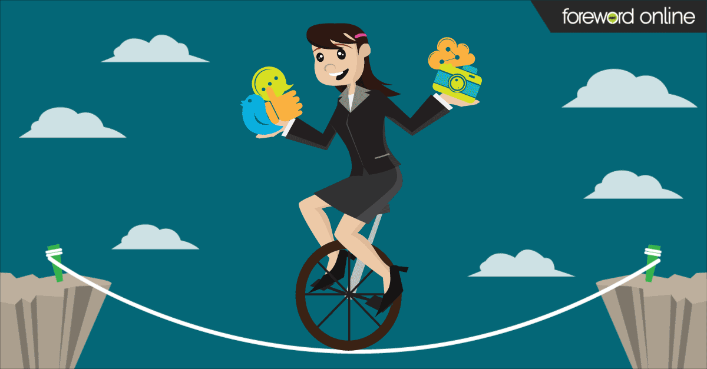

## Addiction Cycle

I constantly delete the apps (instagram) off my phone and after a few days, I come crawling back like some stinky roach and downloading it back. its so bad that we can't even sit still without going on my phone and we feel so leashed.

People have suggested finding new hobbies or learning new skills to distract us, but we always lose motivation within a day or two and end up going back to scrolling.

I honestly think it’s mostly due to boredom and the fear of missing out on trends and news that pulls us back to social media.

## Impact of Social Media Usage

Do we understand this is a problem? Let's think about it:

If we spend just **_3 hours_** a day on social media:

- In one year, that adds up to **_1095 hours_**.
- This means we spend **_45 days_** in just one year, on social media.

When we look at it this way, we can see how much time social media takes from our lives.

## Social Media and Friendship

This is my other perspective on social media which can be good for keeping in touch with friends, especially those you don't see often.
These days, we often use social media or messaging apps to plan things with friends. If you stop using these completely:

- You might miss chances to make your friendships stronger
- Friends might not include you in future plans

Seeing what your friends post can be helpful. You can:

- Check how they're doing
- Say "congratulations" when they do well

## Balance, Not Banish

Some very close friends might visit you in person to tell you what's new. But this would only be your best friends. Even then, not all close friends would do this. This is because friendships aren't always equal. Sometimes one person feels closer than the other does.
It's better to keep your choices open. Friends will come and go in your life. If you stop using social media completely, you might lose all your connections.

Instead of quitting social media all at once, it's better to learn how to control your use of it. It's like taking medicine for pain:

- Too much is bad for you
- But it can be helpful if you use it in the right amount

So, try to find a balance with social media instead of stopping it completely.

## Why exercise

We can keep asking ourself "why" to each answer. This helps us to find the real reason. For example:
Why am I on Instagram right now?
To see what's happening.
Why do I want to see what's happening?
To know what's popular and what my friends are doing.
Why do I want to know these things?
To feel connected to the world and my friends.
Why do I want to feel connected?
Because I work alone at home and don't see people.
Why is that the reason?
Because I'm alone and this is the only way I know how to connect.

You can keep going with these questions to understand yourself better.
