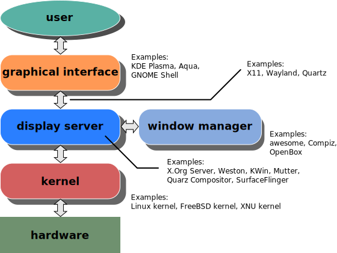

Imagine you’re playing a video game, and your screen is like the game’s playing field. The display server is like the game’s graphics engine that handles everything you see and interact with.

## What's Display Server?

In simple words, A display server is software that controls what you see on your screen and how your computer responds to your mouse clicks and keyboard presses.

It's the helper that puts all the pictures and buttons in the right place so you can use your computer easily.

## What it does?

**1. Shows Graphics:** It draws windows, icons, and other images on screen.

**2. Handles Input:** It listens mouse clicks and keyboard typing and sends this information to the right program.

**3. Coordinates:** It makes sure different programs can show their content properly and respond to your actions.

## &#x20;Display Protocols?

Display servers follow display protocols. Suppose Different games might use different graphics engines, just like how different computers might use different display servers.

Some most common display server protocols, particularly in Linux environments.

### X Window System (Old Games)

X11 is a protocol for managing graphical displays in Unix-like operating systems. Just like older games used classic graphics engines that are a bit slower but still work well.

### Wayland (New Games)

Wayland is a newer protocol designed to replace X11. It aims to provide a more efficient and modern way to handle graphical displays. Just like Newer games use more advanced engines that make graphics look better and run faster.

### Mir (Specialized Games)

Mir is another display server protocol created by Canonical (the company behind Ubuntu). It was intended to be a modern replacement for X11, similar to Wayland. Just like Some games have unique engines built for specific game consoles or setups.

- _X11 and Wayland are most commonly associated with Linux, their usage is not strictly limited to it; they can be found in other Unix-like operating systems as well. However **Microsoft Windows** uses the Windows Display Driver Model (WDDM) for graphics management and DirectX for high-performance graphics tasks. The Windows Composition Engine handles window compositing and rendering._

## Comparison X11 and Wayland

\[_If the below lines are not breaking properly, please switch your browser to Desktop site mode._]

| **Aspect**          | **X11**                                                                                                                                                                                        | **Wayland**                                                                                                                                    |
| ------------------- | ---------------------------------------------------------------------------------------------------------------------------------------------------------------------------------------------- | ---------------------------------------------------------------------------------------------------------------------------------------------- |
| **Language**        | Not tied to a specific programming language. Protocols can be implemented in various languages. C is commonly used for low-level implementations due to its efficiency and hardware proximity. | Not tied to a specific programming language. Protocols can be implemented in various languages. C is often used for low-level implementations. |
| **Internal Logic**  | Uses a client-server model where applications (clients) send requests to the X server, which manages the display.                                                                              | Employs a more direct model where clients render into buffers and pass them to the compositor.                                                 |
| **Protocol Design** | Features a complex protocol with numerous extensions added over time.                                                                                                                          | Aims for simplicity with a core protocol and additional protocols for specific features.                                                       |
| **Performance**     | Network transparency can introduce overhead, potentially affecting performance.                                                                                                                | Direct rendering approach generally offers better performance due to reduced overhead.                                                         |

_Each display server has its own set of protocols and features, influencing how GUIs are rendered and managed on the system._
