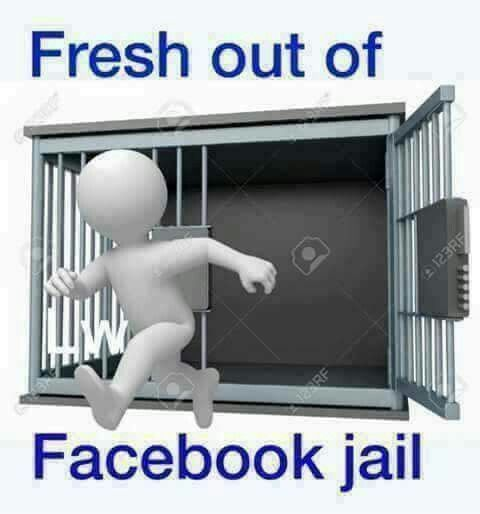
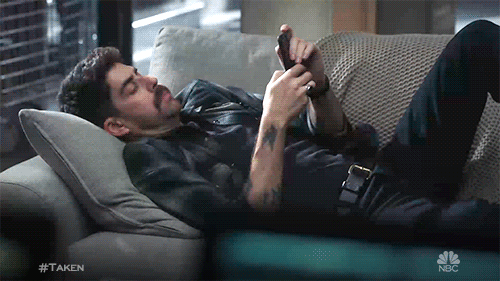

I started my social media during my school days with **_Facebook_**. Back then, I was very active online. For a long time, I wanted to delete Facebook but hesitated. I worried about losing memories, photos uploaded by me and thought I would regret it. Finally, I took the step and deleted it. Till now, 8 years passed, Best descion made by me. Sometimes what we fear isn't actually true.

Then came the **_Instagram era_**. Somehow, I found myself back on social media. I created my account in 12th grade when Instagram surpassed facebook in terms of popularilty(2017). Back then, I thought people without social media accounts were old-fashioned and tech-challenged. How wrong i were! I know\...

I posted many photos, videos and memories over the years, but on October 21, 2024, after using Instagram for 8 years, I decided to delete it too. And just like Facebook, I’m sure I won’t regret it.

Why did I leave? Instagram had become a place of:

1. **Fake perfect lifestyles**
2. **Virtual world which has nothing real**
3. **People showing off their luxurious lives**
4. **Body shaming becoming normal, promotes more physical beauty**
5. **Unrealistic happiness**
6. **Living life according what people like to see**
7. **All fake but everyone pretends that it's real**
8. **Bad for mental health**
9. **Totally time wasting**
10. **Many more 😮💨...**

Life has good and bad chapters - that's natural. But people only show their perfect moments, which makes no sense. **_Why should we care about how cool others look?_** _This isn't real civilization._

While content creators make money, consumers like us pay with our precious time. The app makers collect our data and sell products to us. Actually, we are the real product for them - they sell our attention to make money.

Let's talk about **short videos scroll**.

I think reels/shorts are addictive. Every **10-15 seconds**, our emotions change with each new video. These **quick emotional switches are dangerous**. Social media algorithms control our lives, minds, and perspectives. I don't want to live a life controlled by algorithms from birth to death.

Highly recommendable documentory, Watch this to understand how algo control our life [The Social Dilemma](https://www.google.com/search?gs_ssp=eJzj4tVP1zc0zDJPt0hKskwxYPTiK85PzkzMUUjJzEnNzU0EAJHCCd0&q=social+dilemma&oq=social+delim&gs_lcrp=EgZjaHJvbWUqDAgBEC4YChixAxiABDIGCAAQRRg5MgwIARAuGAoYsQMYgAQyCQgCEAAYChiABDIJCAMQABgKGIAEMgkIBBAAGAoYgAQyCQgFEAAYChiABDIJCAYQABgKGIAEMgkIBxAAGAoYgAQyCQgIEAAYChiABNIBCDc2MzRqMGo0qAIAsAIA&sourceid=chrome&ie=UTF-8)

The science behind short content is interesting. Dopamine, our **_happy hormone_**, increases when we watch entertaining content. When dopamine peaks, normal life seems boring. Our brain starts seeing everyday life as negative because it's not as exciting as social media. This **effect is similar to drug use**.

Will I miss the latest trends and news? Maybe. But so what? For news, the people around me are enough. In a few years, I'll share more about how leaving Instagram has affected my life.

> This is my story of choosing real life over virtual perfection.
