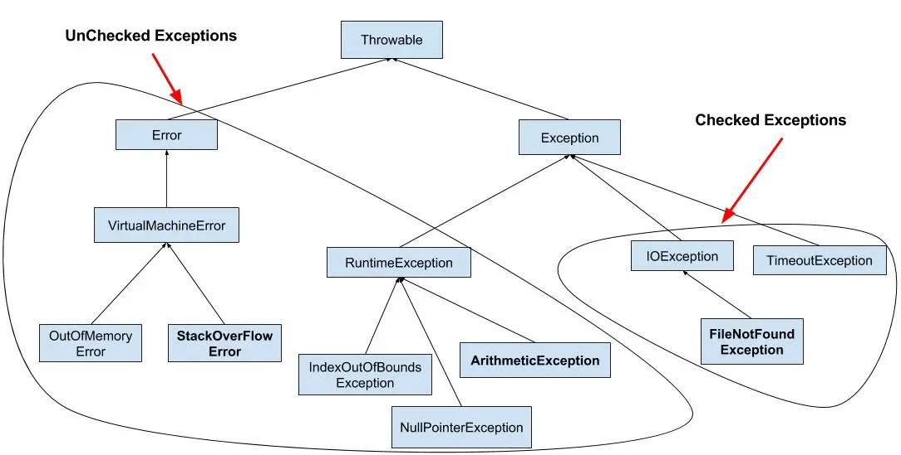
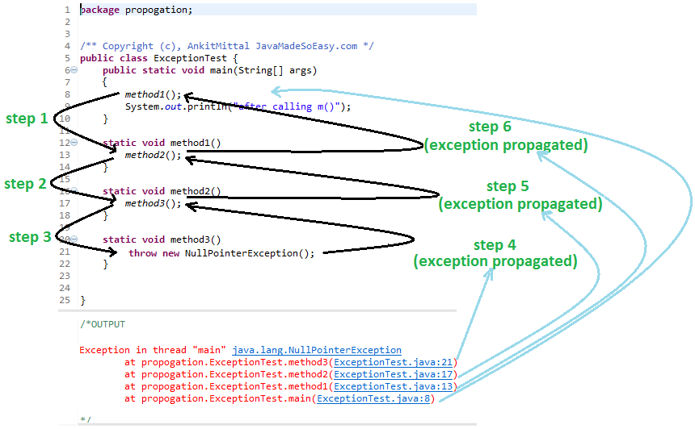
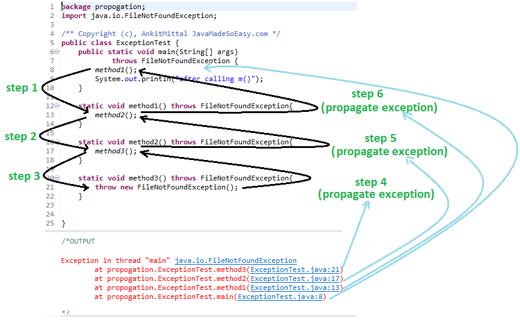

It's like when I was heating milk on the stove. I made the mistake of keeping the flame high, and my attention was elsewhere. As a result, the milk boiled over, spilled, and got wasted.


In this situation, the problem was that my attention was diverted, disrupting my workflow. The milk spilling is the event or incident.

# Exception?

Similarly, in programming, **_Exceptions are an event which disrupt the flow of execution of program._**

To prevent the milk from spilling, I could either lower the flame or focus my attention on it.

In the same way, in Java programming, I can handle exceptions by using a **try-catch** block or by using the **throws** keyword. This handling mechanism we called **_exceptional handling._**

## Use of _try-catch_

The try-catch block in Java is used to handle exceptions (runtime errors) in a program, allowing you to manage errors gracefully **_without terminating_** the program unexpectedly.

```java
public class TryCatchExample {

    public static void main(String[] args) {
        try {
            int[] numbers = {1, 2, 3};
            System.out.println(numbers[3]);  // This will throw ArrayIndexOutOfBoundsException
        } catch (ArrayIndexOutOfBoundsException e) {
            System.out.println("Exception caught: Trying to access an index that doesn't exist.");
        } finally {
            System.out.println("This block always executes.");
        }

        System.out.println("Program continues after exception handling.");
    }
}
```

## Use of the _throws_ keyword

- The throws keyword in Java is used in **method declarations** to specify that the method might throw certain types of exceptions.
- It indicates that a method might throw one or more types of checked exceptions.
- It's **primarily used for checked exceptions**, which are exceptions that the compiler forces you to either handle or declare.
- It allows a method to propagate exceptions up the call stack, letting the calling method decide how to handle them.

```java
import java.io.FileNotFoundException;
import java.io.FileReader;

public class ExampleClass {
    public void readFile(String fileName) throws FileNotFoundException {
        FileReader reader = new FileReader(fileName);
        // Read file operations...
    }
}
```

## Types of Exception


Let's discuss Built-in Exceptions first.

### Built-in Exceptions:

**_These are exceptions that Java provides out of the box (Java libraries). They're ready for us to use without creating anything new._** Think of them as pre-made error messages for common problems. Java exceptions fall into two main categories: **checked exceptions** and **unchecked exceptions**.Examples: NullPointerException, ArrayIndexOutOfBoundsException, ArithmeticException, ClassNotFoundException.



#### Checked Exceptions

- Checked exceptions is also called **Compiled time Exceptions**.
- Checked by the _compiler_ at **compile time**.
- They are **thrown at runtime**, but the handling mechanism must be provided at compile time.
- This means the programmer is required to **handle them explicitly** using a **_try-catch block_** or declare them in the method signature **_using throws_**.
- If not handled, the program will not compile.
- Example: _FileNotFoundException, SQLException, IOException, ClassNotFoundException, etc._

#### Unchecked Exceptions

- Unchecked exceptions is also called **Run time Exceptions**.
- Exceptions **occur at runtime** and are often a result of programming errors, such as logic mistakes or improper use of APIs.
- The programmer is **not required to handle them explicitly**, though it may still be a good practice to do so in certain cases to make the program more robust.

Example: _NullPointerException, ArrayIndexOutOfBoundsException, ArithmeticException (e.g., divide by zero), etc._

#### Difference b/w Checked And Unchecked exception

\[_If the below lines are not breaking properly, please switch your browser to Desktop site mode._]

| **Aspect**             | **Checked Exception**                                      | **Unchecked Exception**                                  |
| ---------------------- | ---------------------------------------------------------- | -------------------------------------------------------- |
| **When it's checked**  | Checked at compile time by the compiler.                   | Not checked at compile time.                             |
| **Must handle it?**    | Yes, we must handle it using `try-catch` or `throws`.      | No, but you can if you want.                             |
| **Common examples**    | `IOException`, `SQLException`                              | `NullPointerException`, `ArrayIndexOutOfBoundsException` |
| **Caused by**          | Usually external factors like file I/O or database issues. | Usually programming mistakes, like dividing by zero.     |
| **Compile-time error** | Yes, if not handled or declared, code won't compile.       | No, it will compile even if not handled.                 |
| **Thrown at**          | Runtime (but handled at compile time).                     | Runtime.                                                 |

Now, let's discuss User-defined Exceptions.

### User-defined Exceptions:

**_These are custom exceptions that we create ourself. we make these when we want to handle specific errors in our program that the built-in exceptions don't cover._**

How to create one:

1. Make a new class
2. Have it extend the Exception class (or a subclass of Exception)
3. Give it a name that ends with "Exception"

Example:

```java
public class MyCustomException extends Exception {
    public MyCustomException(String message) {
        super(message);
    }
}
```

I can use it like this:

```java
public void checkAge(int age) throws MyCustomException {
    if (age < 18) {
        throw new MyCustomException("You must be 18 or older");
    }
    System.out.println("You're old enough!");
}
```

### What is Exception propagation or chained exception in Java?

In many programming languages that support exceptions (like Java, Python, C++, etc.), **_when an exception is thrown in a method, it propagates up the call stack until it's caught by an appropriate exception handler._**

An exception propagates from method to method, up the call stack, until it's caught. So if a() calls b(), which calls c(), which calls d(), and if d() throws an exception, the exception will propagate from d to c to b to a, unless one of these methods catches the exception.

> Only unchecked exceptions are propagated. Checked exceptions throw compilation error

```java
class ExceptionPropagation {
    public static void main(String[] args) {
        a();  // This method calls a()
    }

    static void a() {
        b();  // This method calls b()
    }

    static void b() {
        c();  // This method calls c()
    }

    static void c() {
        d();    // This method calls d()
    }

    static void d() {
        int result = 10 / 0;  // This will throw an ArithmeticException
    }
}

/*
ERROR!
Exception in thread "main" java.lang.ArithmeticException: / by zero
	at ExceptionPropagation.d(ExceptionPropagation.java:19)
	at ExceptionPropagation.c(ExceptionPropagation.java:15)
	at ExceptionPropagation.b(ExceptionPropagation.java:11)
	at ExceptionPropagation.a(ExceptionPropagation.java:7)
	at ExceptionPropagation.main(ExceptionPropagation.java:3)
*/

```

**Unchecked exceptions are automatically propagated in java.**

```java
public class ExceptionTest {
public static void main(String[] args) {
    method1();
    System.out.println("after calling m()");
}

static void method1() {
    method2();
}

static void method2() {
    method3();
}

static void method3() {
    throw new NullPointerException();
}

}
```

Propagating unchecked exception (NullPointerException)



**For propagating checked exceptions method must throw exception by using throws keyword.**

```java
public class ExceptionTest {
public static void main(String[] args) throws FileNotFoundException {
        method1();
        System.out.println("after calling m()");
}

static void method1() throws FileNotFoundException{
        method2();
}

static void method2() throws FileNotFoundException{
        method3();
}

static void method3() throws FileNotFoundException{
        throw new FileNotFoundException();
}

}
```

Propagating checked exception (FileNotFoundException) using throws keyword


