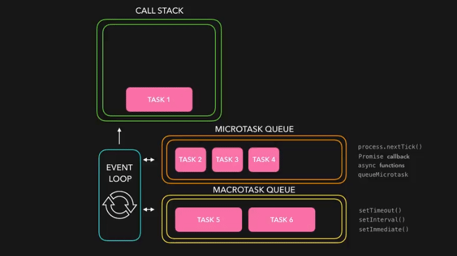

The JavaScript **event loop** is a fundamental concept in **_JavaScript's concurrency model_**.

JavaScript's concurrency model is **_single-threaded_**, meaning it processes one task at a time on the main thread.

**_But the event loop allows it to perform non-blocking operations._**

JavaScript handles one task at a time, but it can start other tasks (like waiting for a timer) in the background and come back to them later when they're ready, without stopping everything else.

**Code Example:**

```javascript
console.log('Task 1') // Runs immediately

setTimeout(() => {
	console.log('Task 2') // Runs after 2 seconds
}, 2000)

console.log('Task 3') // Runs immediately
```

Output:

```markdown
Task 1
Task 3
Task 2
```

Let's take an real life example.

_Me and my friend Jai Prakash went for dinner. we ordered food **(synchronous)** while waiting for it to be prepared, and Jai ordered juice **(asynchronous)** since it was served immediately._

> modern web applications need to handle asynchronous tasks (like fetching data, processing events, timers, etc.) without freezing the user interface or blocking further code execution.

in Technical words,

# Event Loop

The JavaScript event loop is a key part of **_how JavaScript manages asynchronous operations_**, allowing the language to **_handle events_** and **_execute code non-blockingly despite being single-threaded._**

## Key components of the event loop:


### 1. Call Stack

_(Where function calls are stacked and executed.)_

The call stack is where the browser or Node.js stores the current function being executed, as well as any other functions that are called by that function.

### 2. Web APIs/Node APIs

_(Browser-provided threads for handling asynchronous operations.)_

- While JavaScript itself is single-threaded, it leverages the browser (or Node.js) to perform asynchronous tasks.
- These are typically operations like:
  - setTimeout / setIntervals (timers)
  - AJAX calls (fetch, XMLHttpRequest)
  - Event listeners (e.g., user clicks, keyboard input)
  - I/O operations (e.g., file reading in Node.js)
- These tasks are handled by the browser’s Web APIs or Node’s APIs which run in the background (often using multiple threads), separate from the JavaScript engine.

### 3. Callback Queue

_(Where completed asynchronous operations wait to be executed.)_

- When an asynchronous operation completes, the callback (or handler function) associated with it is placed into the callback queue (or task queue).
- The callback queue stores functions that are ready to run but are waiting for the main call stack to become free.

### 4. Microtask Queue

_(A high-priority queue for promises and mutation observers.)_

- Alongside the callback queue, there’s also a microtask queue that handles promises (e.g., Promise.then()).
- Microtasks take priority over the regular callback queue, meaning they will be executed first after the current stack is empty.

### 5. Event Loop

_(Constantly checks the call stack and queues, moving tasks for execution.)_

- The event loop monitors the call stack and event queue.
- It checks if the call stack is empty.
- If the stack is empty, it takes the first event from the queue.
- It pushes the event's callback function onto the call stack.
- This process repeats, allowing asynchronous code to run with synchronous code.

**Code Example:**

```javascript
console.log('Start')

setTimeout(() => {
	console.log('Timeout 1')
}, 0)

Promise.resolve().then(() => {
	console.log('Promise 1')
})

setTimeout(() => {
	console.log('Timeout 2')
}, 0)

Promise.resolve().then(() => {
	console.log('Promise 2')
})

console.log('End')
```

Output:

```markdown
Start
End
Promise 1
Promise 2
Timeout 1
Timeout 2
```

**Explanation:**

1. _Start_ is logged (synchronous).
2. First setTimeout is registered with Web APIs.
3. First Promise is put in the microtask queue.
4. Second setTimeout is registered with Web APIs.
5. Second Promise is put in the microtask queue.
6. _End_ is logged (synchronous).
7. Call stack is empty, so event loop processes microtasks (Promises) first.
8. Timeout(macrotasks) callbacks are then processed from the callback queue.



## Real Life Example:

Imagine someone on a date at a restaurant. They start chatting with their date (**_synchronous task_**) while waiting for their drinks to arrive (**_asynchronous task_**). While they talk, they send a quick text to a friend about the evening (**_microtasks_**). When the drinks finally arrive, they pause their conversation to toast (**_callbacks_**), keeping the flow of the date lively and engaging without missing a beat.

- **Synchronous task:** _Engaging in conversation with the date._
- **Asynchronous task:** _Waiting for drinks to arrive while still interacting._
- **Microtasks:** _Sending a quick text to a friend._
- **Callbacks: Pausing** _for the toast when drinks arrive, seamlessly integrating it into the conversation._
