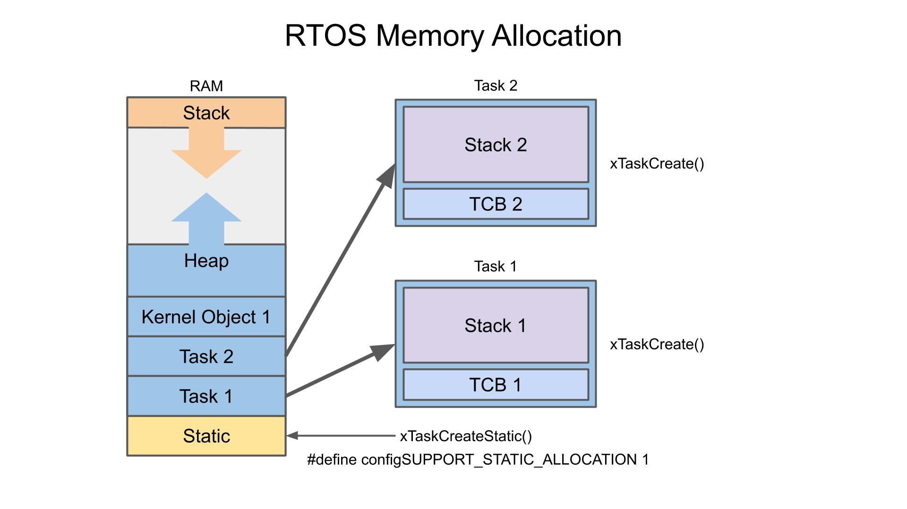

It refers to how a computer manages its working memory. Memory is typically divided into segments, each serving a specific purpose. These areas help the computer organize and access information efficiently, similar to how you might organize a room with different sections for different tasks.

The exact way memory is organized can vary depending on the operating system, programming language, or compiler being used.



## Main types of memory segments

### 1. Stack Segment

**Purpose:** Manages function call information, including local variables, function arguments, and return addresses.

**Features:**

- Grows **_downward_** (toward lower memory addresses).
- Automatically expands and contracts as functions are called and return.
- Uses **_LIFO (Last In, First Out)_** principle to manage the function calls and variables.

**Common Elements:**

- Local variables.
- Return addresses for function calls.
- Stack frames for keeping track of function calls.

**Example:**

```java
public class StackExample {
    public static void main(String[] args) {
        // Local variables are stored in the stack
        int x = 10;
        int y = 20;

        // Calling a method
        int result = add(x, y);
        System.out.println("Result: " + result);
    }

    // Local variables 'a' and 'b' are stored in the stack
    static int add(int a, int b) {
        return a + b;
    }
}
```

below visual breakdown

```markdown
1. Initial State:

[Empty Stack]

2. After main Method Starts:

+-----------------+
| Variable 'x' | <- (x = 10)
+-----------------+
| Variable 'y' | <- (y = 20)
+-----------------+
| Return address | <- Points to the location to return after 'add' completes
+-----------------+

3. After Calling add(x, y):

+-----------------+
| Variable 'x' | <- (x = 10)
+-----------------+
| Variable 'y' | <- (y = 20)
+-----------------+
| Return address | <- Points to the location to return after 'add' completes
+-----------------+
| Stack Frame for add |
| +-----------------+ |
| | Variable 'a' | | <- (a = 10)
| +-----------------+ |
| | Variable 'b' | | <- (b = 20)
| +-----------------+ |
| | Return address | | <- Points to the location to return after 'add' completes
| +-----------------+ |
+-----------------+

4. After add Method Completes:

+-----------------+
| Variable 'x' | <- (x = 10)
+-----------------+
| Variable 'y' | <- (y = 20)
+-----------------+
| Variable 'result' | <- (result = 30)
+-----------------+
| Return address | <- Points to where execution will continue after 'main' completes
+-----------------+

5. After main Method Completes:

[Empty Stack]
```

### 2. Heap Segment

**Purpose:** Dynamically allocates memory at runtime.

**Features:**

- Grows **_upward_** (toward higher memory addresses).
- Used for memory management operations like malloc() and free() in C/C++.
- Allocated memory in the heap needs to be **_explicitly managed_** (allocated and freed) (_thanks to jvm_ 😊).

**Use Case:** Dynamic allocation of data structures like arrays or linked lists that need to persist beyond a single function call.

**Example:**

```java
public class HeapExample {
    public static void main(String[] args) {
        // Creating a new object, which is allocated on the heap
        Person person = new Person("Pranshu", 80);
        System.out.println(person.name + " is " + person.age + " years old.");
    }
}

class Person {
    String name;  // Field allocated on the heap
    int age;      // Field allocated on the heap

    // Constructor
    Person(String name, int age) {
        this.name = name;
        this.age = age;
    }
}

```

below visual breakdown

```markdown
1. Initial State

   Stack:
   +-----------------+
   | Empty |
   +-----------------+

   Heap:
   +-----------------+
   | Empty |
   +-----------------+

2. After Creating Person Object

   Stack
   +-----------------+
   | Variable 'person' | <- Points to the `Person` object on the heap
   +-----------------+
   | Return address | <- Points to the exit location
   +-----------------+

   Heap:
   +-----------------------------+
   | Person Object |
   +-----------------------------+
   | name: "Pranshu" |
   | age: 80 |
   +-----------------------------+

3. After the Person Object Fields are Initialized

Stack:
+-----------------+
| Variable 'person' | <- Points to the `Person` object on the heap
+-----------------+
| Return address | <- Points to the exit location
+-----------------+

Heap:
+-----------------------------+
| Person Object |
+-----------------------------+
| name: "Pranshu" |
| age: 30 |
+-----------------------------+

4. After Printing the Person’s Information

Stack:
+-----------------+
| Variable 'person' | <- Points to the `Person` object on the heap
+-----------------+
| Return address | <- Points to the exit location
+-----------------+

Heap:
+-----------------------------+
| Person Object |
+-----------------------------+
| name: "Alice" |
| age: 30 |
+-----------------------------+

5. After main Method Completes

Stack:
+-----------------+
| Empty |
+-----------------+

Heap:
+-----------------------------+
| Person Object |
+-----------------------------+
| name: "Pranshu" |
| age: 80 |
+-----------------------------+

- Note
  The heap is used for objects that need to persist beyond the scope of a single method. These objects are managed by the Java garbage collector, which reclaims memory for objects no longer in use.
```

### 3. Data Segment

**Purpose:** Stores global and static variables that the program uses.

**Features:**

Divided into initialized and uninitialized data sections.

The size of the data segment can grow as needed.

**Subsections:**

Initialized Data Segment (.data section): Stores global and static variables that are initialized with values.

Uninitialized Data Segment (BSS Segment): Stores global and static variables that are declared but not initialized.

> Note: In Java, the concept of uninitialized data (BSS) is handled differently. All static variables are initialized to default values (e.g., 0 for integers). Java does not provide direct access to BSS-like segments.

**Example:**

```java
public class DataSegmentExample {
    // Static variable with a predefined value (initialized data segment)
    static int initializedValue = 42;

    public static void main(String[] args) {
        System.out.println("Initialized Value: " + initializedValue);
    }
}

```

below visual breakdown

```markdown
1. Initial State:

Data Segment:
+-----------------+
| Empty |
+-----------------+

2. After Class Loading:

   Data Segment:
   +-------------------------------+
   | Static Variable: |
   | initializedValue = 42 |
   +-------------------------------+

3. During main Method Execution:

   Data Segment:
   +-------------------------------+
   | Static Variable: |
   | initializedValue = 42 |
   +-------------------------------+
   Stack (for main method):
   +-----------------+
   | Return address | <- Points to the exit location
   +-----------------+

4. After main Method Completes:

Data Segment:
+-------------------------------+
| Static Variable: |
| initializedValue = 42 |
+-------------------------------+

Stack:
+-----------------+
| Empty |
+-----------------+

- Data Segment: Holds static variables and constants initialized at class loading time. These values persist for the lifetime of the application.

- Stack: Used for method calls and local variables. It is created and destroyed with each method call.
```

### 4. Text(Code) Segment

**Purpose:** This segment stores the actual code or instructions of a program.

**Features:**

It is usually marked as read-only to prevent modification during execution.

Contains executable instructions and functions.

**Example:** Assembly instructions or compiled program code.

### 5. Memory-Mapped Segment

Purpose: Maps files or devices into memory for fast access.

Features:

Can be used for efficient file I/O operations.

File contents are directly accessible as if they were part of the program's memory.

Example: Shared libraries or certain large files being mapped to a process's address space.

Java interacts with hardware indirectly through libraries and APIs. For example, file I/O or network communication is managed using the Java I/O and NIO libraries.

```java
import java.nio.file.Files;
import java.nio.file.Paths;
import java.io.IOException;

public class Example {
    public static void main(String[] args) {
        try {
            // Reading a file using NIO
            String content = new String(Files.readAllBytes(Paths.get("example.txt")));
            System.out.println(content);
        } catch (IOException e) {
            e.printStackTrace();
        }
    }
}

```

### 6. Kernel Space

Java does not interact directly with kernel space. Kernel space is reserved for the operating system and typically not accessible by user programs. Java applications run in user space and interact with the OS through the JVM and system libraries.

### 7. Garbage Collection:

Java uses garbage collection to manage heap memory, automatically freeing up memory that is no longer in use. This process is handled by the JVM and is not directly controlled by the developer.

## Quick Summary


**_Java operates using a JVM (Java Virtual Machine), which abstracts some of these details. However, the fundamental principles of memory segmentation still apply._**

Here’s how memory segments map in Java:

1. **Code Segment** (stores bytecode)
2. **Data Segment** (global/static variables)
3. **Stack Segment** (method calls and local variables)
4. **Heap Segment** (objects and dynamic memory)

```java
public class MemoryExample {
  // Static variable (in Data Segment)
  static int staticVar = 100;

  // Main method (entry point, part of Code Segment)
  public static void main(String[] args) {
        // Local variable (in Stack Segment)
        int localVar = 10;

        // Creating an object (stored in Heap Segment)
        MemoryExample obj = new MemoryExample();

    // Method call (stack frame for the method created in Stack Segment)
    obj.methodExample();

        // Another local variable (in Stack Segment)
        String localString = "Hello, Reader!";  // Reference in stack, object in heap
  }

  // Method example
  public void methodExample() {
        // Local variable (in Stack Segment)
        int methodVar = 50;

    System.out.println("Method Variable: " + methodVar);
  }
}

```

below visual breakdown

```markdown
+-------------------------------------+
| Code Segment |
| |
| - Contains bytecode for methods: |
| - main(), methodExample() |
+-------------------------------------+

+-------------------------------------+
| Data Segment |
| |
| - staticVar = 100 |
+-------------------------------------+

+-------------------------------------+
| Stack Segment |
| |
| - localVar = 10 (main method) |
| - obj reference (main method) |
| - localString reference |
| - Stack frame for methodExample(): |
| - methodVar = 50 |
+-------------------------------------+

+-------------------------------------+
| Heap Segment |
| |
| - MemoryExample object (referenced |
| by obj in stack) |
| - String object "Hello, Reader!" |
+-------------------------------------+
```
