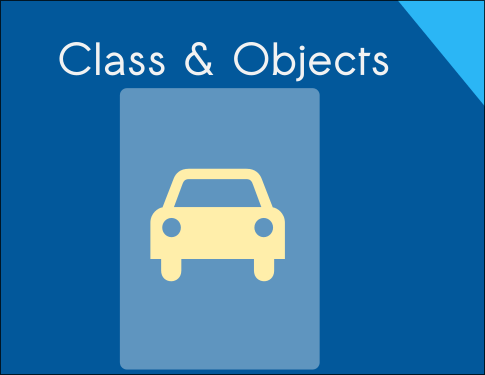
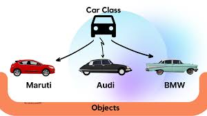
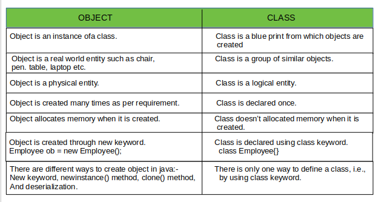
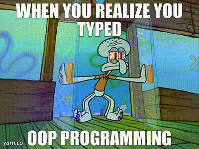
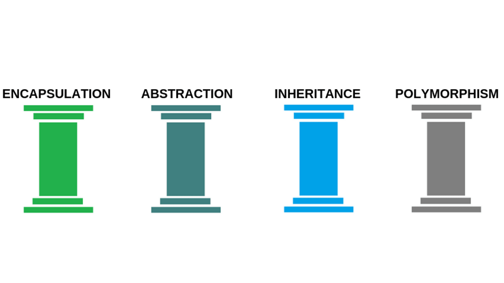

## What Oops?

There are many ways to write code, and it depends on the individual.

First, it's important to understand why programming styles matter. Everyone has their own ideas, ways of thinking, and methods of writing code. Similarly, in programming, each person can solve problems and implement solutions in their own way.


For example, if someone asks, What is Linux? you might hear different explanations:

- Linux is an open-source operating system similar to Windows but with many different versions.
- Linux is a generic term for a family of open-source Unix-like operating systems based on the Linux kernel.
- Like Windows, iOS, and Mac OS, Linux is an operating system. In fact, one of the most popular platforms, Android, is powered by Linux.
- Linux is an open-source operating system based on Unix, known for its stability, security, and flexibility.


Each definition is correct but presents the information differently. Sometimes, it can be challenging to understand all the different styles people use.



In object-oriented programming (OOP), we work with classes and objects. A class is like a blueprint or template for creating objects, while an object is an instance of a class.



For example, imagine you want to invent a car. First, you create a design or template for the car, which is like defining a class. Later, you can build specific cars with different features based on that design. In this case, the car design is like the class, and each specific car model, like a BMW, Audi or Maruti, represents an object.



Using OOP principles helps make code more reusable, modular, easier to debug, and gives you more control over your code.



When creating objects in object-oriented programming (OOP), we follow certain principles to ensure our code is effective and well-organized. These principles are **_Inhertance, Polymorphism, Abstraction, Encapsulation._**



Lets discuss all principles with example.

## Inheritance

Inheritance is like the relationship between a father and his son. If the father is tall, the son is likely to be tall too, thanks to inheritance. For example, if you have a fridge at home, your son can also use it and store things in it. This is known as an "is-a" relationship. In programming, inheritance it is the ability of class to inherit properties to the subclasses.

```python
class Parent:
    def __init__(self, height):
        self.height = height

class Child(Parent):
    def __init__(self, height, name):
        super().__init__(height)
        self.name = name

# The Child class inherits the height property from Parent
child = Child(180, "John")
print(child.height)  # Output: 180
```

## Polymorphism

Poly means many, and morphism means forms. Polymorphism is the ability of a class to provide different implementations of a method depending on the type of object passed. For example, a woman can be a mother, wife, daughter, or professional. This concept can be achieved through runtime polymorphism and compile-time polymorphism.

```python
class Animal:
    def speak(self):
        pass

class Dog(Animal):
    def speak(self):
        return "Bark"

class Cat(Animal):
    def speak(self):
        return "Meow"

def make_animal_speak(animal):
    print(animal.speak())

dog = Dog()
cat = Cat()
make_animal_speak(dog)  # Output: Bark
make_animal_speak(cat)  # Output: Meow

```

## Abstraction

Imagine you want to learn how to drive a car. You need to understand how to use the steering wheel, gears, accelerator, and brake. However, you don’t need to know how the engine, radiator, and other internal parts work to drive the car. Similarly, abstraction is a process of hiding unnecessary or irrelevant details from the user or client. In programming, we can achieve abstraction using interfaces or abstract classes.

```python
abstract class Car {
    abstract void start();
    abstract void stop();
}

class Sedan extends Car {
    void start() {
        System.out.println("Sedan is starting");
    }
    void stop() {
        System.out.println("Sedan is stopping");
    }
}

// User interacts with the Car interface without knowing the details
Car myCar = new Sedan();
myCar.start();  // Output: Sedan is starting
myCar.stop();   // Output: Sedan is stopping

```

## Encapsulation

Encapsulation is the process of bundling properties and behaviors (variables and methods) into a single unit. For example, a medicine capsule contains many chemical ingredients wrapped in the capsule. This wrapping can be seen as encapsulation. Encapsulation provides data hiding and abstraction.

```python
class Capsule:
    def __init__(self):
        self.__ingredients = ["Vitamin A", "Vitamin B"]

    def get_ingredients(self):
        return self.__ingredients

# The internal details of __ingredients are hidden
capsule = Capsule()
print(capsule.get_ingredients())  # Output: ['Vitamin A', 'Vitamin B']
```

_Programming styles are as varied as the people who write code, reflecting unique approaches to problem-solving. Object-Oriented Programming (OOP) streamlines code through principles like inheritance, polymorphism, abstraction, and encapsulation, making it more modular and reusable. Just as driving a car doesn't require knowing its engine's inner workings, OOP hides complexity to simplify development. Embrace mistakes as they are crucial steps in the learning journey, proving that even the smartest among us grow from errors._
