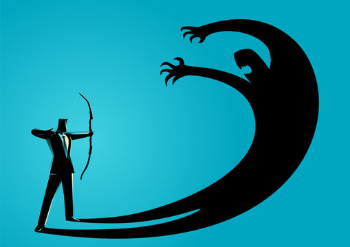
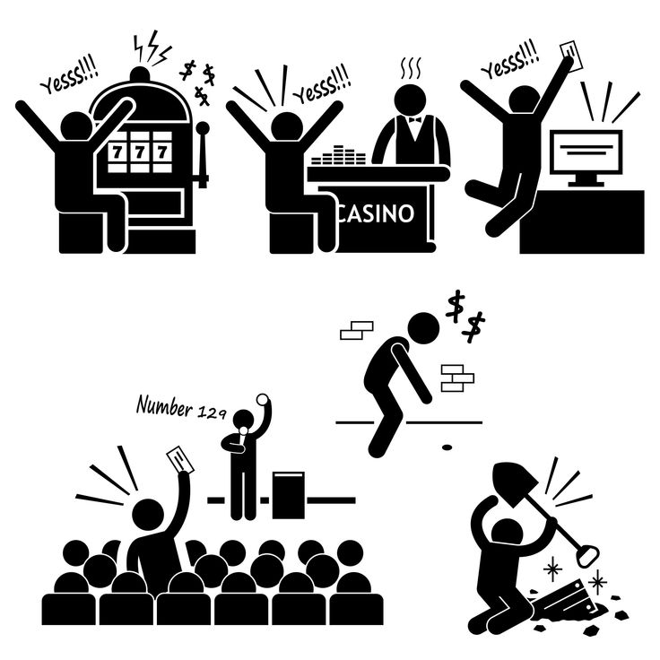
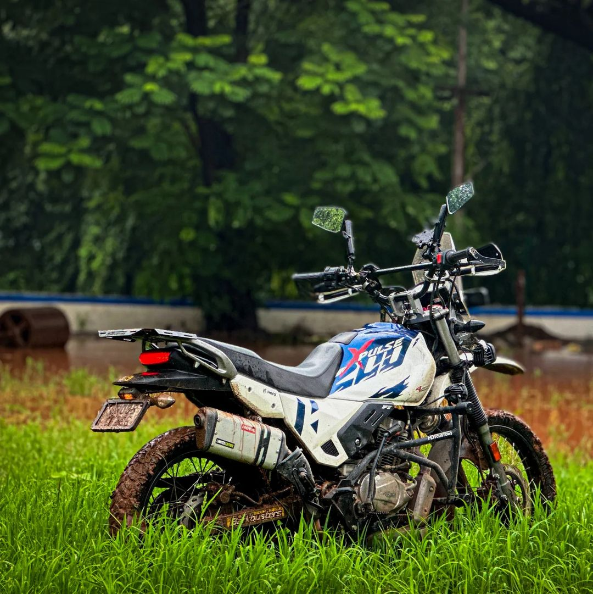
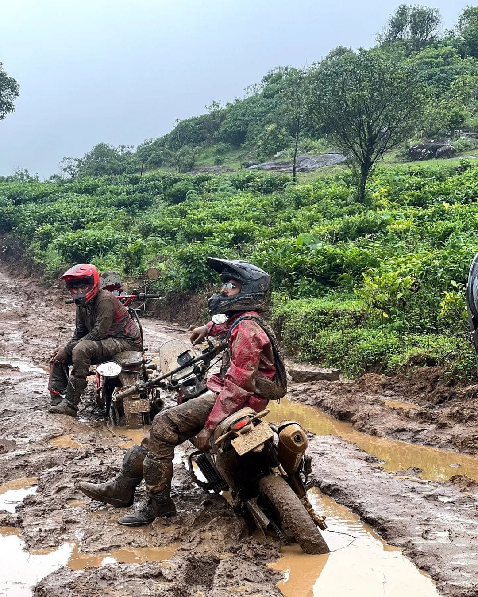
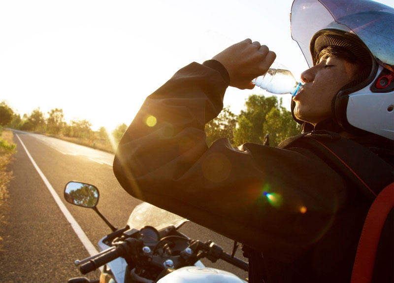
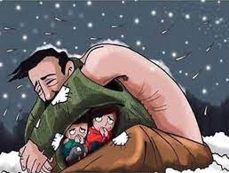

## A Ride to Remember

For a long time, I had been contemplating the idea of serving as a bike taxi driver for a day, just to gain some ground experience. Today, August 10, 2024, I finally executed my plan. The realization and the experience I gained were invaluable—no price could ever quantify their worth.

## Beyond the Desk

An office job and a ground job each come with their own set of challenges—whether it's the mental grind of working at a desk or the physical demands of being on your feet. Both, in their own way, can be equally exhausting and rewarding.

## Facing the Fear

At the start, I was a bit apprehensive—should I go through with this or not? As an engineer, I questioned whether this was the right choice and worried about what people might think if they saw me driving rides. The thoughts swirled in my mind: Would it be impressive? Would it reflect poorly on me? Moreover, I had heard reports of auto drivers in Bangalore harassing bike drivers, fearing a loss of customers to this new mode of transport.

## Embracing Every Job

No job is inherently big or small; its significance is entirely dependent on how we approach it. Some people take on roles out of necessity, others for personal fulfillment, and some due to responsibilities. We shouldn't overthink our choices. As I share this experience, I’m not concerned with how readers perceive me. My intention is to capture and reflect on this experience. Whether people find it enjoyable or not is subjective and depends on individual perspectives.

## First Ride With An IITian

During my first ride, I met a man who had recently been hired as a backend developer at JP Morgan, straight from IIT Madras. He was a bit surprised when I introduced myself, and it was interesting to connect with someone from the same professional community. He mentioned he had read news articles about engineers doing this job on weekends for fun, and now he saw me as an example. I laughed, feeling a bit pleased that this experience might leave a lasting impression on him.\
\

I then asked him about his academic prowess, assuming that as an IITian, he must be exceptionally intelligent. He explained that getting into IIT is less about intelligence and more about a combination of concentration, luck, and hard work. Even with the right focus and effort, if luck isn’t on your side, getting into IIT can be out of reach. He believed he had all three qualities. As he reached his destination, I dropped him off, reflecting on the insights shared during our brief encounter.

## Riding Through Different Vibes

During my second and third rides in the drizzling weather, I noticed how each individual had their own unique vibe. It's fascinating how these vibes interact with and respond to my own energy. While I’m not sure about the science behind it, the experience felt undeniably true.

## A Dream Ride For Customer

\
On my fourth ride, I encountered a man whose eyes lit up when he saw my bike. He mentioned that it was his dream bike, and I felt a surge of pride for my "kitpu" (my dirt bike). I affectionately patted its metal tank, appreciating its significance. He worked at a TVS showroom and shared some insights and opinions about South Indian people.

Later, we arrived at a location with a 100-meter-long stretch of mud. Riding through that was an exhilarating experience for my bike, which handled the terrain flawlessly. Although I was initially apprehensive about wheel slippage, the bike performed admirably. This ride strengthened the trust between me and my bike, reaffirming its excellence for off-road adventures.

## Reflections in the Sun

\

My final ride was with a client who worked as an HR professional in an MNC, heading to Koramangala. By around 1:50 PM, I was exhausted, surrounded by people who seemed to be working hard, likely for their families. The heat was intense, and I was thirsty, hungry, and feeling the sun's harsh rays.\
\

In that moment, I reflected on how much parents, especially fathers, endure for their children. They endure the scorching sun and other hardships for our sake. This self-realization came to me as I felt the physical strain of the day. As children, we often see our parents merely as providers, not fully understanding the depth of their sacrifices. While we might grasp this concept intellectually, experiencing physical exhaustion can bring a more profound understanding of their struggles.
\

Overall, these rides marked my first and last experience in this role. It was a day filled with valuable observations and profound realizations.
