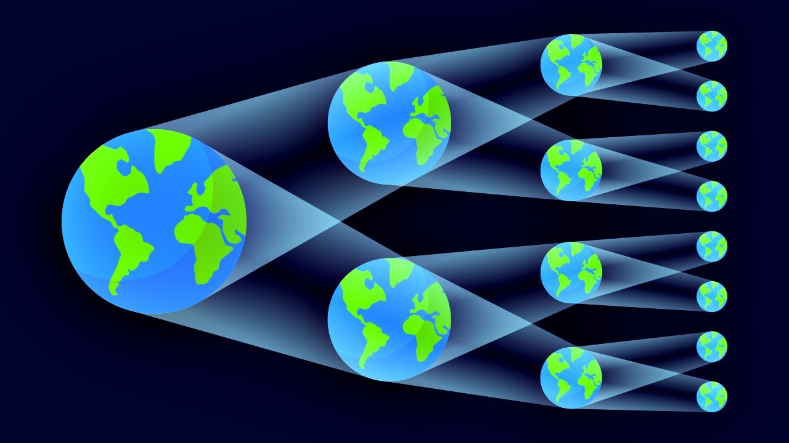
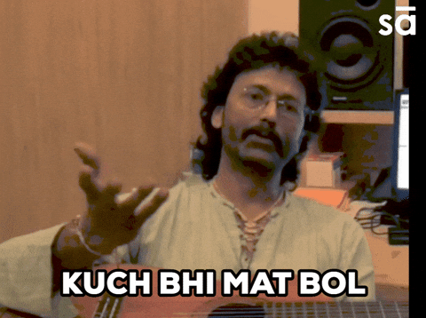

Main ek gehri soch mein dooba. Kabhi kabhi doobna jaroori hai aur samjhna bhi ham kitne depth tak cheejo ko analyze kar sakte hai. Yeh sirf ek khud se conversation nahi, balki ek aisi journey hai jo mujhe mere existence ke sabse gehre sawaalon tak le ja rahi hai. Kya meri reality sirf ek illusion hai? Kya main kisi badi system ka ek puppet hoon?

## Parallel Universe aur Existence ka Sawal

Maine parallel universe ke concept par sochna shuru kiya. Quantum mechanics ke **[Many-Worlds Interpretation](https://en.wikipedia.org/wiki/Many-worlds_interpretation)** ke through yeh samajh aaya ki har quantum event ke multiple outcomes hote hain, aur har outcome ek naya universe create karta hai. **[String theory](https://en.wikipedia.org/wiki/String_theory)** ke mutaabiq hamara universe ek bubble jaisa hai, aur aise anek universes parallel exist kar sakte hain.

Phir ek aur gehra sawal dimag mein aaya, **_Time badhta ja raha hai, main bada ho raha hoon, budha ho jaunga aur fir mar jaunga... lekin aisa kyun? Kya har universe mein yahi likha hai?_** Yeh entropy ka concept hai. har system time ke saath degrade hota hai, chahe woh insaan ho ya pura universe. Time sirf aage badhta hai, kabhi peeche nahi jata, isliye maut ek anivarya sach hai.

## Illusion hai kya?

Baat aage badhi, aur maine apni ek ajeeb si feeling mehsoos ki. Mujhe lagta hai jaise main is duniya mein exist hi nahi karta. Sab kuch ek illusion lagta hai, jaise ek sapna. Yeh **derealization** ho sakta hai. Ek aisi state jisme duniya unreal lagti hai, jaise sirf ek observer hoon, jo duniya ko dekh raha hai, aur bas kisi ke bataye hue instructions ko follow kar raha hu.

Har cheez ajeeb hai, meri purani yaadein bhi ek alag tarah ki nostalgic aur uncanny feeling deti hain. Shayad kisi trauma ke baad meri perception badal gayi hai. Sab kuch surreal lagta hai.

## Hum Kaun Hain? Kya Koi Hame Control Kar Raha Hai?

Ek aur ajeeb soch aayi. Mujhe lagne laga ki koi external entity hame control kar rahi hai. Yeh thought **[determinism](https://en.wikipedia.org/wiki/Determinism)** aur **[simulation theory](https://en.wikipedia.org/wiki/Simulation_hypothesis)** se juda ho sakta hai.

Maine ek analogy sochi:

**_Jaise phone charge hota hai (paida hona), fir use chalaya jata hai (zindagi jeena), aur fir phone dead ho jata hai (death). Phone ko nahi pta ki kaun use control kar raha tha._**

Shayad ham bhi ek aise hi system ka part hai, jiski hame puri samajh nahi hai.

## Final Thoughts

Yeh soch mujhe ek aur realization tak le jaati hai - main hamesha apne existence aur reality par sawaal karta rahunga. Main kaun hoon? Main yahan kyun hoon? Kya meri reality actually real hai? Shayad in sawaalon ke jawaab mujhe kabhi na milen, Ya shayad wo mere aas paas hi hon. Shayad kuch kitaabon mein, Science mein, Spirituality mein, Philosophy ke gehre samundar mein. Let me find it. Milega to jaroor aur likhunga ispar.

Haan, topic thoda crazy hai😂, lekin sochna hi toh humein baaki creatures se alag banati hai. Yahi soch humein naye ideas deti hai, naye raaste dikhati hai. Hum science se tareeke dhoondhte hain, philosophy se matlab samajhte hain, Spirituality se sukoon talaash karte hain, aur art se jazbaat bayan karte hain.
