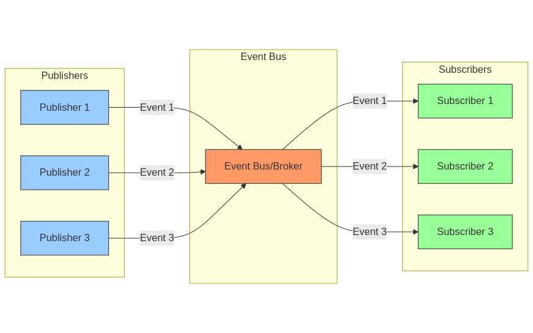

Event-driven architecture (EDA) is a software design pattern that allows applications to communicate and respond to events in real time.

In an EDA, events are used to trigger actions, such as sending a message to other applications when a change occurs.



## Core Concepts

1. **Events:** Things that happen in the system, like _"order placed"_ or _"payment received"_.
2. **Publishers:** Components that create and send out events.
3. **Subscribers:** Components that listen for and react to events
4. **Event Bus/Broker:** The messenger that delivers events from publishers to subscribers.

.webp>)

## How It Works

1. The **Publisher** creates an event (e.g., _"Order Placed"_).
2. The event goes to the **Event Bus**.
3. The **Event Bus** notifies all interested **Subscribers**.
4. The **Subscribers** then react to the event (e.g., update inventory, send notifications).

## Real-World Analogy

Think of it like a news service:

- **Publishers** are like journalists writing stories.
- The **Event Bus** is like a news agency that distributes stories.
- **Subscribers** are like people who receive notifications about specific types of news.

## Simple Example

Imagine an **e-commerce system**:

- A customer places an order (Event: _"OrderPlaced"_).
- Multiple systems react to this single event:
  - The **_Inventory System_** reduces stock.
  - The **_Notification System_** sends a confirmation email.
  - The **_Shipping System_** creates a shipping label.
  - The **_Analytics System_** updates sales dashboards.

## Key Benefits

- **Loose Coupling:** Components don’t need to know about each other.
- **Scalability:** Easy to add new publishers or subscribers.
- **Flexibility:** Easy to add new features without changing existing ones.
- **Real-Time Processing:** Events are processed as they happen, making systems more responsive.

## Common Use Cases

- Microservices Communication
- IoT Systems: Sensors and devices can generate events that trigger real-time responses.
- Real-Time Analytics
- Mobile App Notification
- Financial Trading Systems
- Game Development

## Simple Implementation Patterns

Here’s a basic implementation of an event-driven pattern in Java:

```java
import java.util.ArrayList;
import java.util.HashMap;
import java.util.List;
import java.util.Map;

// EventBus class
class EventBus {
    private Map<String, List<EventListener>> subscribers;

    public EventBus() {
        subscribers = new HashMap<>();
    }

    // Subscribe to an event
    public void subscribe(String eventType, EventListener listener) {
        if (!subscribers.containsKey(eventType)) {
            subscribers.put(eventType, new ArrayList<>());
        }
        subscribers.get(eventType).add(listener);
    }

    // Publish an event
    public void publish(String eventType, Object data) {
        if (subscribers.containsKey(eventType)) {
            for (EventListener listener : subscribers.get(eventType)) {
                listener.handleEvent(data);
            }
        }
    }
}

// EventListener interface for handling events
interface EventListener {
    void handleEvent(Object data);
}

// Usage example
public class Main {
    public static void main(String[] args) {
        EventBus eventBus = new EventBus();

        // Subscriber function as lambda
        EventListener orderHandler = (data) -> {
            System.out.println("Processing order: " + data);
        };

        // Subscribe to event
        eventBus.subscribe("order_placed", orderHandler);

        // Publish event
        Map<String, String> orderData = new HashMap<>();
        orderData.put("order_id", "123");

        eventBus.publish("order_placed", orderData);
    }
}
```

## Best Practices for Event-Driven Architecture

- **Keep Events Simple:** Focus events on specific actions (e.g., _"OrderPlaced"_).
- **Graceful Failure Handling:** Ensure systems can handle errors smoothly.
- **Event Ordering:** If needed, ensure events are processed in the right order.
- **Error Handling and Retries:** Implement logic to retry failed operations.
- **Monitor and Log Events:** Keep track of event flow and performance to avoid issues.

## Challenges to Consider

- **Event Consistency and Ordering:** Managing the order in which events are processed can be tricky.
- **Error Handling and Recovery:** Ensuring all subscribers receive events, especially in failure scenarios, requires careful design.
- **Event Versioning:** Over time, events may evolve, and you’ll need strategies to handle changes.
- **Monitoring and Debugging:** With many independent components, debugging issues in event flows can be challenging.
- **Testing:** Testing systems where events trigger other processes adds complexity.

## When to Use

- **Distributed Systems:** EDA is perfect for systems with many independent components.
- **Real-Time Processing:** When you need instant feedback or reactions.
- **Complex Workflows:** EDA works well for complex, multi-step workflows.
- **Scalability:** When you need to easily scale specific parts of the system.

## When Not to Use

- **Simple CRUD Applications:** For simple Create, Read, Update, Delete operations, EDA might be overkill.
- **Strict Sequential Processing:** If your system requires strict order of operations, other architectures may be a better fit.
- **Small Monolithic Applications:** For small applications, EDA can add unnecessary complexity.
- **Simple, Linear Workflows:** When the system can be handled with a simple, linear flow, a more straightforward approach is usually better.

## Some of Software Architecture Patterns

- [Layered Architecture Pattern (click)](https://pranshu.tech/post/software-architecture-pattern/layered-architecture-pattern/)
- [Monolithic Architecture Pattern (click)](https://pranshu.tech/post/software-architecture-pattern/monolithic-architecture-pattern/)
- [Microservices Architecture Pattern (click)](https://pranshu.tech/post/software-architecture-pattern/microservices-architecture-pattern/)
- [Microkernel Architecture Pattern (click)](https://pranshu.tech/post/software-architecture-pattern/microkernel-architecture-pattern/)


