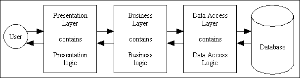

Layered architecture is a way of organizing software into separate levels, or _layers_, where each layer has a specific role or responsibility.

Let's break it down in simple terms

**1. Presentation Layer**

- This is like the **_face_** of application
- What users see and interact with
- Examples: buttons, screens, forms

**2. Business Layer**

- This is the **_brain_** of your application
- Contains all the rules about how things should work
- Example: calculating total price with tax in a shopping app

**3. Persistence Layer**

- This is like a translator between app and the database
- Handles how data is saved and loaded
- Example: converting user information into a format that can be saved

**4. Database Layer**

- This is like a filing cabinet where all data is stored
- Actual storage of information
- Example: storing user accounts, products, orders

## Important Feature

**Two-Way Traffic:** Information typically flows from top to bottom vice versa, like flight from Bengaluru to Lucknow and Lucknow to Bengaluru

**Independence:** Each layer can be changed without affecting others.

**Organization:** Similar things stay together (like keeping all UI elements in the presentation layer)

## When to Use This Pattern

- Perfect for simple applications.
- Good for small user bases (less than 200 users).
- Great for projects where requirements won't change much.
- Ideal for learning and starting out.

## Limitations

**Speed:** Like taking stairs in a tall building, requests must go through each layer, which can be slow.

**Changes:** Like moving furniture in a full room, making changes can be tricky.

**Updates:** If you change one layer, you usually need to redeploy the whole application.

## Real Time Example

## Some of Software Architecture Patterns

- [Monolithic Architecture Pattern (click)](https://pranshu.tech/post/software-architecture-pattern/monolithic-architecture-pattern/)
- [Microservices Architecture Pattern (click)](https://pranshu.tech/post/software-architecture-pattern/microservices-architecture-pattern/)
- [Event-Driven Architecture Pattern (click)](https://pranshu.tech/post/software-architecture-pattern/event-driven-architecture-pattern/)
- [Microkernel Architecture Pattern (click)](https://pranshu.tech/post/software-architecture-pattern/microkernel-architecture-pattern/)

