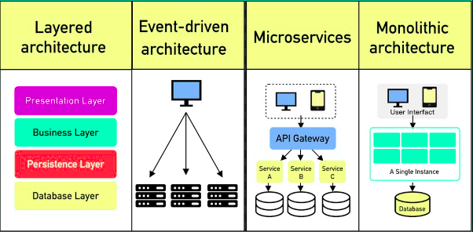

## Microkernel Architecture?

The microkernel architecture, also known as a plug-in architecture, is a software design pattern where a system is **_split into two main parts_**: the core system (the microkernel) and plug-in components.

**1. Core system**

The core system handles the basic, essential functions that are common for most users.

**2. Plug-in components**

Plug-in components add extra features and functionality. These are separate from the core and can be added or removed without changing the core system.

## Real-World Use Cases

**1. Web Browsers**

- **Chrome**
  - Core: Basic browsing, rendering
  - Plug-ins: Ad blockers, password managers, themes
- **Firefox**
  - Core: Navigation, security
  - Plug-ins: Developer tools, privacy extensions

**2. Content Management Systems**

- **WordPress**
  - Core: Content creation, user management
  - Plug-ins: SEO tools, e-commerce, forms
- **Drupal**
  - Core: Content organization, user roles
  - Plug-ins: Community features, media handling

## Advantages

- **Flexibility:** You can add or remove plug-ins easily without needing to change the main system.
- **Easier Updates:** Since each part is separate, updating or testing a plug-in is simpler and faster.
- **Customizable:** You can build a system with only the features you need by choosing specific plug-ins.

## Disadvantages

- **Limited Scalability:** This architecture works well for smaller systems but may not handle very large, complex applications well.
- **Complexity:** Managing plug-ins, their connections, and ensuring they work together smoothly can be tricky and require careful design.

## Key concepts of the Microkernel Architecture pattern

- **Registry:** A system that keeps track of all available plug-ins and helps the core interact with them.
- **Contracts:** Agreements between the core system and plug-ins on how they communicate and share data.

## When to Use Microkernel Architecture

### Good fit for :-

- Applications needing **high customization**
- Systems with **constantly evolving features**
- Products that cater to **diverse user needs**
- **Development platforms** supporting plugins or extensions

### May not suit :-

- **High-performance systems** requiring speed and efficiency
- **Simple, static applications** with fixed functionality
- **Resource-constrained environments** with limited memory or processing power
- Systems that require **tight integration** across all components

## Some of Software Architecture Patterns

## Some of Software Architecture Patterns

- [Layered Architecture Pattern (click👆)](https://pranshu.tech/post/software-architecture-pattern/layered-architecture-pattern/)
- [Monolithic Architecture Pattern (click👆)](https://pranshu.tech/post/software-architecture-pattern/monolithic-architecture-pattern/)
- [Microservices Architecture Pattern (click👆)](https://pranshu.tech/post/software-architecture-pattern/microservices-architecture-pattern/)
- [Event-Driven Architecture Pattern (click👆)](https://pranshu.tech/post/post/software-architecture-pattern/event-driven-architecture-pattern/)

