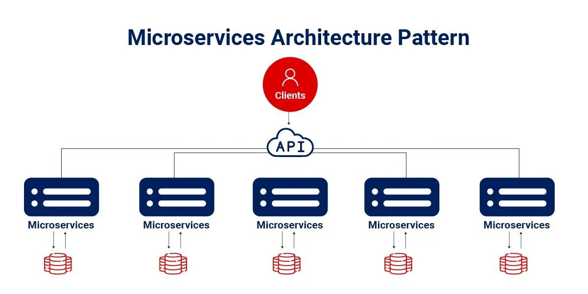
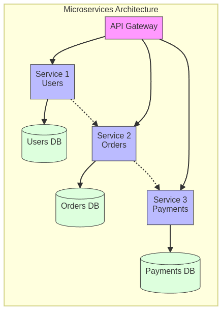
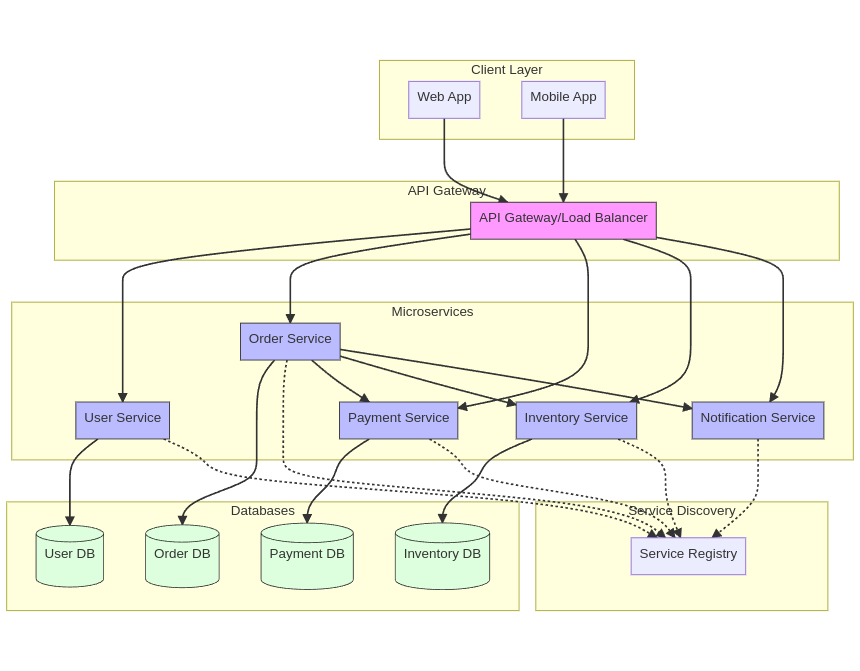
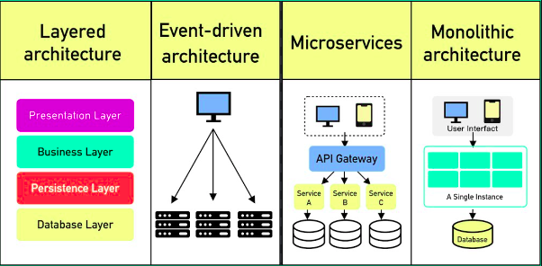

Microservices architecture is a design approach where a large application is **broken down into smaller, independently deployable services**.

These services communicate with each other using lightweight mechanisms, often _APIs_.

Each service focuses on a specific business function, making the application more flexible, scalable, and reliable.

## Core Features

- Small, focused services **_(one service = one business function)_**
- Independent deployment
- Decentralized data management _(each service has its own database)_
- API-based communication
- Service discovery and load balancing
- Containerization (typically using Docker)
- Automated deployment (CI/CD)

## Advantages

- **Independent Deployment:** Services can be updated without affecting others.
- **Technology Flexibility:** Each service can use a different tech stack.
- **Scalability:** Scale specific services based on demand.
- **Fault Isolation:** If one service fails, it won’t bring down the whole system.
- **Team Autonomy:** Teams can work on services independently.
- **Easier Maintenance:** Smaller services mean smaller codebases to manage.
- **Better Fault Tolerance:** Issues in one service don't affect others.

## Disadvantages

- **Increased Complexity:** More services mean more to manage.
- **Network Latency:** Communication between services can be slow.
- **Data Consistency:** Keeping data in sync across services is difficult.
- **Testing Complexity:** Testing multiple services working together is harder.
- **Operational Overhead:** More services mean more monitoring and management.
- **Complex Development Environment:** Harder to set up locally.
- **Deployment Coordination:** Managing versions of different services can be tricky.

## When to Use

- For **large, complex applications**.
- When **frequent updates** are needed.
- When **high scalability** is a priority.
- When teams are **working on different parts** of the system.
- When different parts of the system have **different resource needs**.
- For organizations with **multiple development teams**.
- Applications with **clear business boundaries**.

## When Not to Use

- For **small** or **simple applications**.
- When you have a **limited development team**.
- When **time and resources** are tight.
- If **network latency** is a big concern.
- When **strong data consistency** is required.

## Use Cases

1. **E-commerce Platforms:** Services for Products, Orders, Payments, Shipping, Users.
2. **Social Media Applications:** Services for User Profiles, Posts, Comments, Notifications.
3. **Banking Systems:** Services for Accounts, Transactions, Loans, Investments.
4. **Streaming Platforms:** Services for User Management, Content Delivery, Recommendations.

## Best Practices

1. **Design Principles:**
   - One business function per service.
   - Focus on API-first design.
   - Loose coupling between services.
   - High cohesion within each service.
2. **Development:**
   - Use containers _(Docker)_
   - Implement circuit breakers for fault tolerance.
   - Maintain API documentation
   - Automate testing for all services.
3. **Data Management:**
   - Each service should manage its own database.
   - Use event sourcing if necessary.
   - Handle distributed transactions properly
4. **Operations:**
   - Centralized logging
   - Monitor and alert on service performance.
   - Automated deployment
   - Use service discovery for dynamic service locations.

## Some of Software Architecture Patterns

- [Software Architecture Pattern (click)](https://pranshu.tech/post/Software-Architecture-Pattern/)

- [Layered Architecture Pattern (click)](https://pranshu.tech/post/software-architecture-pattern/layered-architecture-pattern/)
- [Monolithic Architecture Pattern (click)](https://pranshu.tech/post/software-architecture-pattern/monolithic-architecture-pattern/)
- [Event-Driven Architecture Pattern (click)](https://pranshu.tech/post/software-architecture-pattern/event-driven-architecture-pattern/)
- [Microkernel Architecture Pattern (click)](https://pranshu.tech/post/software-architecture-pattern/microkernel-architecture-pattern/)
