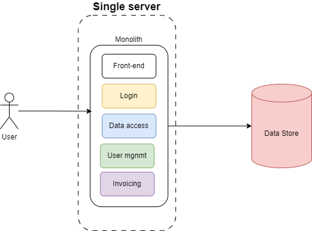

In software development, a monolithic architecture model is one where a single codebase is used to perform multiple functions in an application.

## Monolithic Architecture

- A single, unified application containing all functionality.
- Everything packaged together in one deployable unit
- All components run in the same process.
- Uses one technology stack throughout the application.



### Example

In a monolithic e-commerce application, all features like displaying products, processing orders, and accessing product data are part of the same codebase.

```java
// All functionality in one application
public class EcommerceApp {
    // User Interface Components
    class UserInterface {
        void displayProducts() { /* ... */ }
        void showCart() { /* ... */ }
    }

    // Business Logic
    class OrderService {
        void placeOrder() { /* ... */ }
        void processPayment() { /* ... */ }
    }

    // Data Access
    class ProductRepository {
        void saveProduct() { /* ... */ }
        void getProduct() { /* ... */ }
    }
}
```

## Advantages

- **Simple to develop:** Easier for smaller teams to manage and understand.
- **Easy to deploy (single unit):** Since it's a single unit, you only need to deploy once.
- **End-to-End testing:** Testing the whole application is straightforward.
- **Scales Horizontally:** You can scale the entire app by cloning and running on multiple servers.
- **Less complexity:** With no distributed components, networking and monitoring are simpler.

## Disadvantages

- Size grows over time
- Hard to maintain as complexity increases
- Long build/deploy times
- Must **_redeploy entire app_** for small changes
- Technology stack is fixed : **_Switching technologies is challenging_** since everything uses the same stack.
- Can be **_harder to understand_** a large, tightly-coupled codebase for new developers

## Best Use Cases

- **Small to Medium applications:** Great for apps that don't need complex scalability or heavy integrations.
- **Startups/MVPs:** Ideal for building minimum viable products quickly and efficiently.
- **Simple business domains:** Works well for straightforward business logic.
- **Small development teams:** Easier for small teams to handle without over-complicating the architecture.
- **Minimal integration needs:** Best for applications that don't rely heavily on external services or systems.

## Best Practices for Monolithic Architecture

- **Maintain Clear Module Boundaries:** Separate concerns using well-defined modules.
- **Layered Architecture:** Organize your code into layers (e.g., presentation, business logic, and data).
- **Caching:** Implement caching to reduce load and improve performance.
- **Coding Standards:** Follow consistent coding guidelines across the application.
- **Regular Refactoring:** Clean up and optimize your code as it grows.
- **Proper Logging and Monitoring:** Keep track of application performance and issues with good logging practices.

## Real-World Example Structure

```markdown
my-monolithic-app/
├── src/
│ ├── presentation/
│ │ ├── controllers/
│ │ └── views/
│ ├── business/
│ │ ├── services/
│ │ └── models/
│ └── data/
│ ├── repositories/
│ └── entities/
├── resources/
├── tests/
└── config/
```

This structure separates the presentation, business, and data layers, ensuring some organization within the single codebase.

## Some of Software Architecture Patterns

- [Layered Architecture Pattern (click)](https://pranshu.tech/post/software-architecture-pattern/layered-architecture-pattern/)
- [Microservices Architecture Pattern (click)](https://pranshu.tech/post/software-architecture-pattern/microservices-architecture-pattern/)
- [Event-Driven Architecture Pattern (click)](https://pranshu.tech/post/software-architecture-pattern/event-driven-architecture-pattern/)
- [Microkernel Architecture Pattern (click)](https://pranshu.tech/post/software-architecture-pattern/microkernel-architecture-pattern/)


