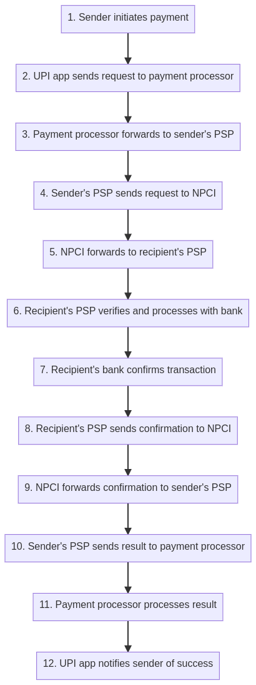
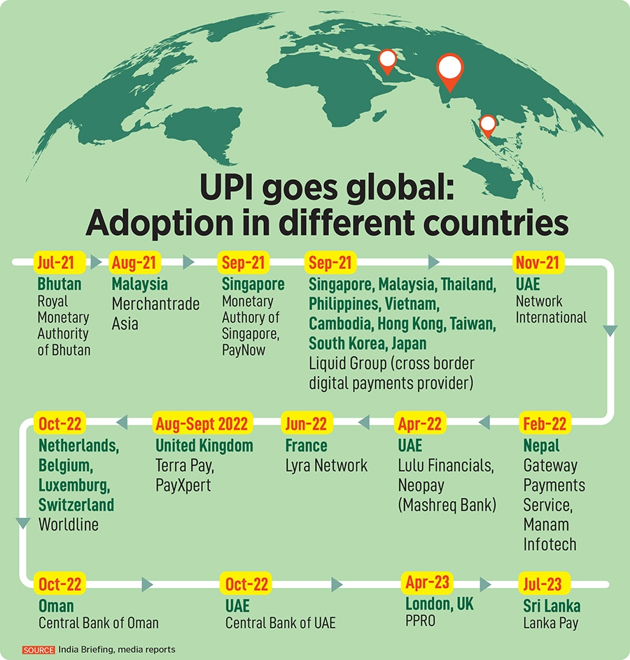

We all know that information is everywhere, and technology is evolving rapidly, from your smartphone to your bike helmet, from ChatGPT to your wristwatch. Between 2010 and 2024, everything has changed significantly.

Using cards or cash for payments is Hassle. Today, I'll share insights about UPI, a technology developed in India 🇮🇳. It's considered one of the best payment systems in the world, and i would say India is seen as a global leader in instant payments.

## UPI?

UPI - Unified Payments Interface is an instant real-time payment system developed by **NPCI** to facilitate inter-bank transactions through **_mobile phones_**.

UPI is like the matchmaker for your money—it lets you transfer cash from one bank to another instantly, like a love letter sliding into someone's DMs, but without the drama! Just a phone number, a tap, and voilà, your funds are off to their new home, no awkward goodbyes required. It's like making your money do yoga: **_flexible, fast, and stress-free!_**

## NPCI?

The National Payments Corporation of India (NPCI) is a non-profit organization that manages India's retail payments and settlement systems. The NPCI was established in 2008 as an initiative of the **_Reserve Bank of India (RBI)_** and the **_Indian Banks' Association (IBA)_**.

## Key Features of UPI

**Instant Transfers:** UPI enables immediate money transfers, allowing users to send and receive funds 24/7 without delays associated with traditional banking methods.

**User-Friendly:** Transactions can be initiated using a unique UPI ID (similar to an email address or unique id) and a UPI PIN, simplifying the payment process.

**Multiple Transactions:** UPI supports various types of transactions, including peer-to-peer (P2P) transfers (one person to another) and payments to merchants (P2M), making it versatile for both personal and business use.

**No Transaction Fees:** UPI transactions are generally free for individuals, promoting financial inclusivity and encouraging the use of digital payments.

**Security:** UPI employs a secure architecture with multiple layers of encryption, ensuring the confidentiality and integrity of user data during transactions

## Powerful Encryption

_Multiple layers of end-to-end Encryption_ and _stringent protocols_ implemented by the system which enhance security and make UPI robust.

_encryption ek aisa process hai jisme data ko is tarah badal diya jata hai ki usse koi bhi samajh na sake, jab tak usko decrypt karne ke liye sahi key na ho. Upi me multiple encryption hai. Aur **good encrypt matlb something which you can't decrypt**. simply data ko iss tarike se convert karna jise dekhkr kch bhi nahi samjha jaa sake ki wo hai kya yahi hai encryption._

When I was working on a banking integration for my company, I observed how crucial data is, especially for banking systems. The way they want multi-encrypted data in the banking system is to ensure the highest level of security by using multiple layers of encryption algorithms, such as **AES** _(Advanced Encryption Standard)_ and **RSA** _(Rivest–Shamir–Adleman)_, to protect sensitive information like customer details, transaction details, and financial data.

This multi-encryption process ensures that even if one encryption layer is compromised, the data remains secure through additional encryption layers, minimizing the risk of data breaches and ensuring regulatory compliance with financial security standards.

_encryption ke under bhi encryption fir usme unke format me encoding_ 😵‍💫 A data breach is intolerable.

## &#x20;Flow of UPI transaction

**1. Initiate payment:** The sender uses their UPI app on their phone to start a payment, entering the recipient's _UPI ID or phone number_ and the amount to send.

**2. Process payment request:** The UPI app (e.g., PhonePe, Google Pay) sends the payment request to a payment processor like JusPay, Razorpay, etc.

**3. Forward processed request:** The payment processor applies security checks, optimizes the transaction, and forwards the processed request to the sender's payment service provider (PSP). PSPs (usually banks), it manages the payment infrastructure and communication between banks and NPCI.

**4. Send payment request:** The sender's PSP sends this payment request to the NPCI (National Payments Corporation of India).

**5. Forward request:** NPCI checks the request and forwards it to the recipient's PSP.

**6. Verify and process:** The recipient's PSP verifies the details and processes the payment with the recipient's bank account.

**7. Confirm transaction:** The recipient's bank confirms that the transaction can be completed (e.g., sufficient funds are available).

**8. Send confirmation:** The recipient's PSP sends a confirmation back to NPCI.

**9. Forward confirmation:** NPCI forwards this confirmation to the sender's PSP.

**10. Send result:** The sender's PSP sends the transaction result back to the payment processor.

**11. Process result:** The payment processor processes the result, potentially adding additional information or analytics.

**12. Notify success:** The UPI app notifies the sender that the payment was successful.

**_The above entire process happens within seconds, making UPI transactions quick and convenient. This is how the information flows between the different parties involved in a UPI transaction._**

## More Insights

- Meet the Real-time NoSQL Database Leading India’s Explosive UPI Growth [click](https://analyticsindiamag.com/ai-origins-evolution/meet-the-real-time-nosql-database-leading-indias-explosive-upi-growth/)
- UPI has become the world's leading alternative payments method, surpassing Alipay, PayPal, and Brazil’s PIX in transaction volume. [click](https://timesofindia.indiatimes.com/technology/tech-news/upi-surpasses-worlds-leading-digital-payments-platforms-with-this-record/articleshow/112949499.cms)
- List of countries where Indians can use UPI to make payments [click](https://economictimes.indiatimes.com/wealth/save/how-to-activate-make-payments-using-upi-international/articleshow/107626614.cms?utm_source=contentofinterest&utm_medium=text&utm_campaign=cppst)
- From India To The World: How UPI Is Transforming Cross-Border Payments [click](https://inc42.com/resources/from-india-to-the-world-how-upi-is-transforming-cross-border-payments/)
- How digital payments became democratic – the UPI way [click](https://economictimes.indiatimes.com/tech/newsletters/ettech-unwrapped/how-digital-payments-became-democratic-the-upi-way-and-other-top-tech-startup-stories-this-week/articleshow/103293579.cms?from=mdr)
- Why NPCI is the crown jewel of Indian fintech [click](https://www.moneycontrol.com/news/business/economy/why-npci-is-the-crown-jewel-of-indian-fintech-11328241.html)
- How India is taking UPI global [click](https://www.forbesindia.com/article/take-one-big-story-of-the-day/how-india-is-taking-upi-global/87477/1)

