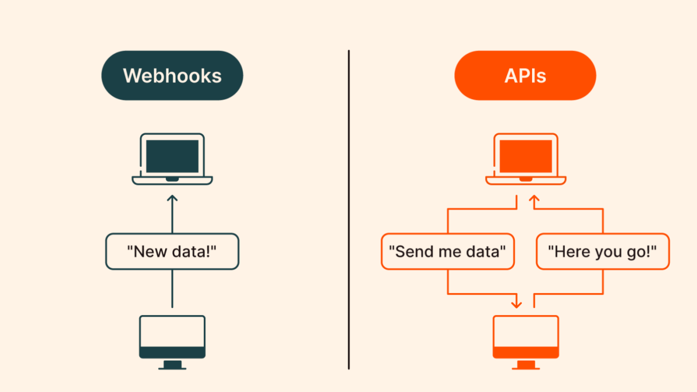

A webhook is a way for applications to send **_real-time data or notifications_** to other systems via a simple HTTP request.

They work by sending **_HTTP POST_** requests to a predefined URL when specific events occur.

## Webhooks?

**Purpose:** Webhooks allow for automated, event-driven communication between different systems or applications.

- HTTP callbacks for real-time notifications
- Event-driven architecture
- Useful for integrations and automation

## Real Life Example

Let's say you have an online store where people can buy things. To handle payments, you use a separate service (the payment gateway) that processes credit cards.
You want to know right away when someone successfully pays for something in your store. Instead of constantly asking the payment service _"Did anyone pay yet?"_, you can set up a special alert system.
This alert system works like this:

1. You give the payment service a specific web address (URL) for your store's computer system.
2. Whenever someone successfully pays, the payment service automatically sends a message to that address.
3. Your store's system gets this message instantly and can update the order status to **_"Paid"_**.

This way, your store always knows when a payment happens, without having to keep checking. It's like having the payment service tap your shoulder to say _"Hey, someone just paid!"_ instead of you repeatedly asking _"Did anyone pay yet?"_

## How Webhooks Work:

1. **Setup:** An application (Client A) registers a webhook with another system (Server B). Client A
   provides a webhook URL where it wants to receive event data.
2. **Event Triggered:** Server B triggers an event (e.g., a user makes a purchase).
3. **Webhook Fired:** Server B sends an HTTP request (POST) to Client A’s webhook URL, containing
   the event’s data.
4. **Processing:** Client A receives the data and processes it (e.g., updating a database or sending a notification).

## Use Cases for Webhooks:

1. **Payment processing:** Notify when a payment is made.
2. **CI/CD pipelines:** Source code repository updates.
3. **Communication tools:** Send real-time notifications to messaging platforms like Slack.
4. **Event-driven workflows:** Kick off processes in response to external events.
5. **CRM systems:** Sync customer data when new contacts are added.

## Advantages:

- **Real-time updates:** Information is sent immediately when events occur.
- **Efficiency:** Reduces the need for frequent polling to check for updates.
- **Scalability:** Can handle large volumes of events across multiple systems.

## Disadvantages:

- **Error handling:** If the receiving server is down or the webhook request fails, it can be
  challenging to handle retries or data loss.
- **Security risks:** Since webhooks are URLs that receive sensitive data, proper security measures
  (like secret tokens, authentication, and validation) are required to prevent malicious attacks.

> A webhook is a special type of API that sends data automatically to a specified URL in response to specific events being triggered.
